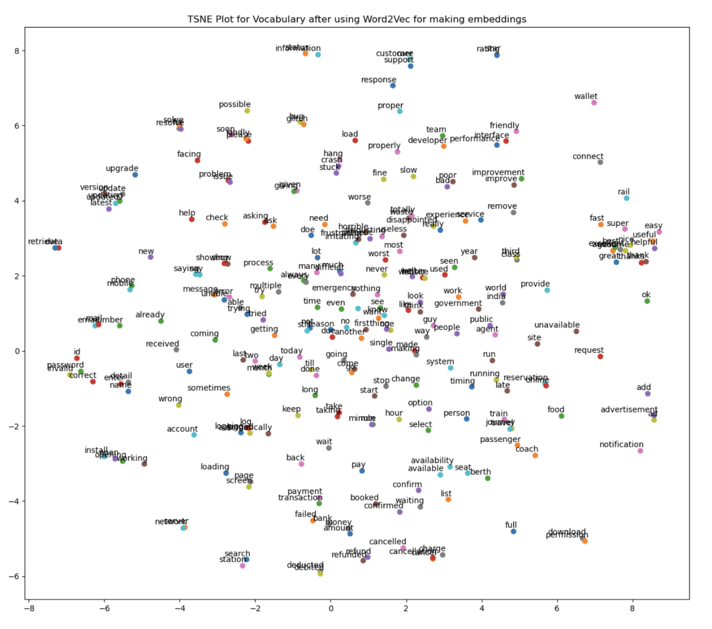

# Topic Mining and Sentiment Analysis on IRCTC Reviews Project

This repository contains work on **topic mining, sentiment analysis, and visualization** of textual data (on IRCTC Reviews scraped using selenium webdriver).  
The project explores multiple approaches to extract latent themes from large text corpora, followed by sentiment-driven analysis of key terms.  

 **Note:** The raw dataset is not uploaded here due to its large size. Only cleaned notebooks and generated visualization files are included.

---

##  Project Overview

1. **Data Collection**  
   - A **Selenium-based web scraper** was built to automatically collect text data from online sources.  
   - Data was cleaned, normalized, and preprocessed for downstream tasks.  

2. **Topic Modeling**  
   - **Count Vectorizer + LDA** (`count_lda_approach_1.html`)  
   - **TF-IDF Vectorizer + LDA** (`tf_lda_approach_1.html`)  
   - **BERT-based embeddings** with topic distribution visualization(`bert_model_intertopic_dist.html`)
   - final modelling using UMAP on bert embeddings and HDBSCAN Clustering to arrive at final topic model. (plots in `DM_Clean.ipynb`)

3. **Dimensionality Reduction & Visualization**  
   - **t-SNE projection** of the vocabulary and topic clusters for interactive exploration.  

4. **Sentiment Analysis**  
   - Generated **positive sentiment word cloud** to highlight terms strongly contributing to positive polarity.  

5. **Evaluation & Comparison**  
   - Compared **topic coherence** and **intertopic distance maps** across Count-based LDA, TF-IDF LDA, and BERT embedding approaches.  

---

##  Repository Structure

```
Topic-Modeling-Sentiment-Project/
│── DM_Clean.ipynb # Data cleaning, preprocessing, exploratory analysis and modelling all techniques in sequential manner
│── bert_model_intertopic_dist.html # Interactive intertopic distance map (BERT-based LDA)
│── count_lda_approach_1.html # LDA with Count Vectorizer
│── tf_lda_approach_1.html # LDA with TF-IDF
│── images/
│ ├── tsne_plot.png # t-SNE of vocabulary clusters
│ └── positive_sentiment_wordcloud.png # Word cloud of positive sentiment terms
│── README.md
```

---

## Key Visualizations

### 1. Intertopic Distance Map (BERT-LDA)
Interactive HTML visualization of topic distributions:  
👉 [Click to view](bert_model_intertopic_dist.html)  


---

### 2. t-SNE Projection of Vocabulary
  
This plot shows how vocabulary terms cluster into semantically coherent regions in 2D space.

---

### 3. Positive Sentiment Word Cloud
  
Highlights the most frequent **positively associated terms** in the dataset.

---

## Methodologies Tested

- **LDA with Count Vectorizer**
- **LDA with TF-IDF Vectorizer**
- **BERT embeddings + K-Means**
- **UMAP on BERT embeddings with HDBSCAN Clustering**
- **t-SNE dimensionality reduction**
- **Sentiment word cloud generation**

---

## Key Insights

- **Count vs. TF-IDF LDA**: Count-based LDA yielded more coherent topics for smaller datasets, while TF-IDF provided finer-grained themes.  
- **BERT embeddings**: Captured contextual relationships, yielding richer intertopic distance visualizations.  
- **t-SNE + Word clouds**: Enhanced interpretability by visually mapping terms and highlighting sentiment-bearing words.  

---

##  Data Availability
- The dataset is **not uploaded** due to its large size.  
- Scripts and methodology are reproducible with similar text datasets.  

---
